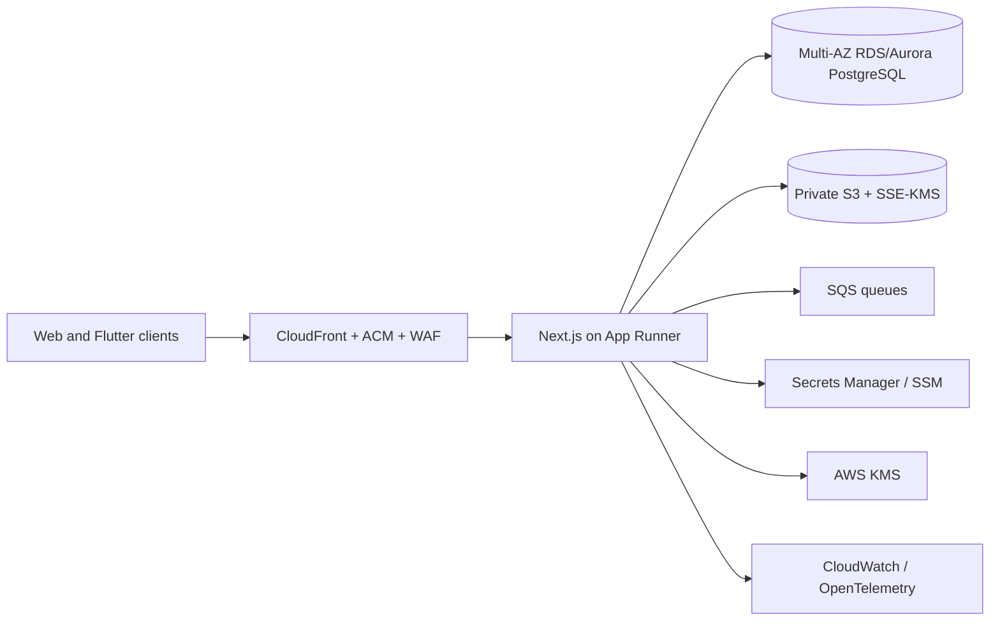

# Hig School production migration plan

Status: **Approved on 29 July 2026 — Stages 0–1 completed; Stage 2 implementation in progress (schema, migration, RLS, seed, and offline contracts complete; driver/container gates pending)**
Audit date: 29 July 2026  
Target: AWS `ap-south-1`, standard Next.js App Router on Node.js 22, PostgreSQL, Redis, S3, SQS

## 1. Purpose and guardrails

This plan migrates the current sales-demo-oriented application to a production-grade, multi-tenant SaaS suitable for handling school, student, guardian, staff, payment, and driver-location data.

The implementation phase must follow these rules:

1. Land one reviewable, PR-sized stage at a time.
2. Each stage's own build and tests must pass before the next stage begins. An intermediate stage does not need to be independently production-deployable or end-to-end feature complete.
3. Preserve the business rules in `server/*/validation.ts`.
4. Preserve repository domain behavior while replacing D1-specific persistence.
5. Do not expose the sales demo in a production runtime.
6. Apply the approved architecture decisions recorded in Section 7. Revisit App Runner versus ECS Fargate only at the Stage 11 checkpoint using real pilot traffic.
7. Do not place real secrets in the repository, Docker image, environment examples, client bundles, logs, or mobile source.

## 2. Audit scope and evidence

The audit covered:

- Framework and build configuration: `package.json`, Next/Vite/Vinext config, Worker entry point, Cloudflare bindings, Dockerfile, TypeScript, and PostCSS.
- All production and demo API routes under `app/api/v1/**`.
- All repositories and validation modules under `server/**`.
- `db/schema.ts`, `db/index.ts`, Drizzle configuration, and all checked-in SQLite migrations.
- Web login and role layouts, Company and School portals, and the three Flutter clients.
- Docker/Hostinger instructions, demo SQL, local data persistence, and release artifacts.
- Tests, tenant-guard helpers, sensitive-data forms, payment settings, file inputs, and GPS flows.

Baseline results:

- The 29 existing unit tests pass.
- A scoped ESLint run over `app`, `server`, `db`, and `tests` passes.
- The repository-wide TypeScript command fails because generated release contents are included in `tsconfig.json`; a copied preview imports an undeclared package.
- A stock Next.js 16.2.6 webpack build fails on:
  - the unsupported `cloudflare:workers` module scheme;
  - build-time downloads from Google Fonts;
  - an incorrectly inferred workspace root caused by another lockfile above this project.
- A Turbopack build reports the same incorrect root selection and did not complete during the audit probe.
- This workspace has no `.git` directory. A trustworthy baseline commit/repository must be restored or initialized before PR-sized delivery can begin.

Next.js 16.2 is a current stable release line and the existing App Router conventions are broadly compatible with stock Next.js. The blockers are primarily runtime/build integration, not the route file convention itself. References:

- [Next.js App Router](https://nextjs.org/docs/app)
- [Next.js 16.2](https://nextjs.org/blog/next-16-2)
- [Standard Next.js installation and scripts](https://nextjs.org/docs/app/getting-started/installation)

## 3. Current-state findings

### 3.1 Critical findings

| Area | Current condition | Risk |
|---|---|---|
| Authentication | Production APIs trust `oai-authenticated-user-email` and related headers. | A caller that can reach the app directly can impersonate any email unless a trusted proxy is guaranteed and cannot be bypassed. |
| Authorization | None of the school API routes call `requireTenant`, `enforceTenant`, or `requirePermission`. | Any authenticated identity can request another school's identifier and read or mutate its data. |
| Platform scope | `/api/v1/schools` and tenant administration routes check identity only, not a Company/platform role. | Any authenticated identity can potentially list or administer schools. |
| Demo identity | Plaintext passwords and static bearer tokens are committed in `server/demo-store.ts`; web/mobile clients use them. | Credentials are public, non-expiring, non-rotating, and unsuitable for production. |
| Secret storage | Payment-provider credentials and other settings are stored as plaintext JSON in `school_configurations`; masking occurs only on response. | Direct database access exposes live payment and integration secrets. |
| Database | Every production repository imports `cloudflare:workers` and executes D1/SQLite SQL directly. | The application cannot run as a standard Node deployment and has no production PostgreSQL path. |
| Demo store | `node:sqlite` is reachable from deployed `/api/v1/demo/**` routes and is the identity/data source used by the UI. | A production build can expose sales-demo accounts and mutable demo data. |
| Route protection | Company and School layouts protect access only after client rendering via a demo-session fetch. | This is not server-side authorization and can leak rendered/client data or create inconsistent redirects. |
| Transport security | Hostinger's example listens on HTTP without an HTTP-to-HTTPS redirect; demo cookies lack `Secure`; mobile defaults allow HTTP. | Credentials, session tokens, and personal data can traverse plaintext connections if deployed incorrectly. |

### 3.2 High findings

- `users` has `mfa_enabled` but no password hash, MFA secret, recovery code, authenticator lifecycle, session, refresh, login-attempt, lockout, or device-history schema.
- Repository-local `requireSchool` checks confirm existence only. They do not prove the actor belongs to the tenant.
- Several writes use D1 `batch`, but the intended production atomicity and isolation levels are not specified.
- `school_configurations.payload_json` can contain SMTP passwords, Telegram/WhatsApp tokens, webhook secrets, video-provider secrets, gateway credentials, and arbitrary future fields.
- Payment references are plaintext. No Razorpay webhook endpoint, raw-body signature verification, replay protection, queue, or reconciliation workflow exists.
- The readiness endpoint reports the tenant guard as healthy without testing database, Redis, queue, or dependency readiness.
- Files selected in admissions, staff, books, and document screens have no secure S3 upload, malware scanning, tenant authorization, retention, or deletion path.
- Driver GPS streams precise location using a static demo account and token.
- The Flutter Staff and Driver apps automatically log in with hardcoded credentials. Mobile tokens live only in memory, but no secure refresh/token-storage design exists.
- The main School client is a 533 KB, 1,287-line source file. This is not itself a migration blocker, but it raises regression risk and makes security-sensitive UI review difficult.
- Static sample data and production repository data are mixed in the same Company/School experiences.

### 3.3 Database and SQL portability findings

The schema has a useful shared-table `tenant_id` pattern and should keep it. The PostgreSQL port must address:

- `sqliteTable`/`sqlite-core` → `pgTable`/`pg-core`.
- Text timestamps → `timestamp with time zone`; calendar-only values → PostgreSQL `date`.
- Integer booleans → PostgreSQL `boolean`.
- Money values → `bigint` in paise to avoid overflow at scale.
- JSON text fields → `jsonb` where querying or validation is useful.
- D1 `?` bindings and response shapes → Drizzle query builder or parameterized `sql`.
- `GROUP_CONCAT` → `string_agg`, `array_agg`, or `json_agg`.
- D1 `batch` → explicit PostgreSQL transactions.
- D1-specific statement/result types and `env.DB` → a bounded `pg.Pool` behind `DATABASE_URL`.
- Current uniqueness and indexes must be reviewed for tenant leading columns and high-volume attendance/reporting queries.
- PostgreSQL row-level security should be added as defense in depth, with `SET LOCAL app.tenant_id` inside a transaction. Application tenant checks remain mandatory.
- Composite tenant-aware foreign keys should be used where practical so a child row cannot reference a parent from another tenant.
- Old SQLite migrations must be archived as legacy artifacts and replaced by a clean PostgreSQL migration history. They must not be run against PostgreSQL.

Drizzle officially supports PostgreSQL through both `node-postgres` and `postgres.js`. For ECS plus RDS Proxy, this plan recommends `node-postgres` because its explicit pool behavior is straightforward and it avoids prepared-statement caveats noted for some AWS configurations:

- [Drizzle PostgreSQL guide](https://orm.drizzle.team/docs/get-started-postgresql)

### 3.4 Stock Next.js compatibility findings

Compatible or expected under the current App Router:

- `app/**/page.tsx` and `layout.tsx`.
- Async `headers()` and promise-based dynamic route params.
- Route handlers returning `Response.json`.
- `dynamic = "force-dynamic"`.
- Client components using `next/link`, `usePathname`, and browser `fetch`.

Required changes:

- Replace `vinext dev/build/start` with `next dev/build/start`.
- Remove Vite, Vinext, Wrangler, Worker image optimization, Sites Vite integration, Cloudflare environment types, D1 examples, and `.openai/hosting.json`.
- Remove `cloudflare:workers` imports before expecting a stock Next build to pass.
- Use bundled/local fonts so production builds do not require Google Fonts network access.
- Set the Next.js project/build tracing root explicitly.
- Set `output: "standalone"` for a small, portable container.
- Ensure Node-only modules run only in the Node runtime.
- Update Docker output from `dist`/Vinext artifacts to `.next/standalone`, `.next/static`, and `public`.
- Exclude release bundles, generated artifacts, and local data from TypeScript/ESLint/build contexts.

## 4. Tenant and API authorization audit

The existing tenant helper is sound as a primitive but is unused outside tests.

| Route family | Current check | Required target check |
|---|---|---|
| `/api/v1/schools` | Header identity only | Authenticated platform user plus `platform.schools.view`/`platform.schools.manage`. |
| `/api/v1/schools/:schoolId` | Header identity only | Platform administration permission; explicit audit reason for sensitive actions. |
| `configuration` | Header identity only | Tenant membership, exact tenant match, `settings.view` or `settings.manage`; secret-setting actions require stronger step-up/MFA. |
| `foundation` | Header identity only | Tenant membership, exact tenant match, action-specific academic/settings permission. |
| `operations` | Header identity only | Tenant membership and separate attendance/fees permissions. Consider splitting the combined endpoint to avoid over-broad access. |
| `roles` | Header identity only | Tenant membership and `roles.manage`; read access should also be explicit. |
| `students` | Header identity only | Tenant membership and `students.view`/`students.manage`; response-field minimization by role. |
| `workspace` | Header identity only | Tenant membership plus a server-owned module-to-permission map. Client-supplied `moduleKey` is not authorization. |
| `/api/v1/demo/**` | Static demo token/cookie | Available only in an explicit non-production sales-demo runtime; otherwise return 404 before reading request data. |
| `health` | Public | Liveness only; no sensitive details. |
| `readiness` | Public detailed success claim | Internal/load-balancer-only or minimally disclosed; verify actual PostgreSQL, Redis, queue, and key-provider readiness. |

Every API test suite must include:

- unauthenticated denial;
- cross-tenant read denial;
- cross-tenant write denial;
- missing-permission denial;
- correct-tenant/correct-permission success;
- platform-role versus tenant-role separation;
- suspended/locked user and tenant behavior;
- audit event creation for privileged writes.

## 5. Sensitive-data and DPDP review map

This section flags legal-review and data-minimization work. It is not legal advice.

### 5.1 Data currently persisted or transmitted

- Student name, date of birth, gender, admission number, roll number, class, section, attendance, exams/assessments, homework, library activity, and fee status.
- Guardian name and phone.
- Payment amount, method, transaction/reference data, due status, and receipts.
- School administrator and staff identity.
- Driver, vehicle, route, precise latitude/longitude, speed, heading, and trip status.
- Notices, PTM records, health-related workflow descriptions, and audit metadata.

### 5.2 Data present in current forms or planned UI

- Guardian email, parent names, phones, occupations, relationship, and identity documents.
- Student height, weight, medical conditions, allergies, bank account, IFSC, and Aadhaar/national ID.
- Birth certificates, transfer certificates, previous-school records, photographs, address proof, and guardian ID.
- Staff date of birth, addresses, emergency contacts, blood group, marital status, qualifications, bank account, PAN, Aadhaar, PF, ESI, UAN, family details, and social profiles.
- SMTP passwords, messaging tokens, webhook secrets, live-class provider credentials, and payment-gateway keys.

### 5.3 Required review points

- Define the lawful purpose, notice, consent/guardian authorization, age handling, retention, correction, export, grievance, and erasure workflows for each category.
- Collect only the fields enabled by an approved school policy; do not make health, Aadhaar, bank, or family fields default requirements.
- Separate operational necessity from optional analytics/marketing.
- Provide role- and purpose-limited field views; teachers should not automatically receive financial, identity-document, or medical detail.
- Record consent/notice version, actor, timestamp, purpose, and withdrawal state.
- Establish retention schedules for admissions, attendance, grades, payment, CCTV/GPS if later added, audit logs, rejected applications, and uploaded documents.
- Add data-subject search/export/correction/deletion workflows with legal-hold support.
- Review cross-border transfer and subprocessors before enabling non-India regions or third-party messaging/AI services.
- Complete a legal/privacy review for India's DPDP Act 2023 and applicable rules before onboarding real students.

## 6. Approved initial architecture

Terraform will provision a lean first-production topology in `ap-south-1`:

Networking baseline:

- Separate dev and production environments.
- At least two Availability Zones.
- App Runner uses only the private connectivity required to reach PostgreSQL and AWS services.
- PostgreSQL has no public endpoint.
- Security-group paths limited to the exact service-to-service ports.
- Do not add NAT-heavy networking, RDS Proxy, ElastiCache, broad VPC endpoint coverage, or separate ECS workers before Stage 11 sizing review.

RDS Proxy remains a later scaling option for managed connection pooling and failover support:

- [RDS Proxy concepts](https://docs.aws.amazon.com/AmazonRDS/latest/AuroraUserGuide/rds-proxy.howitworks.html)
- [RDS Proxy usage scenarios](https://docs.aws.amazon.com/AmazonRDS/latest/AuroraUserGuide/rds-proxy-best-practices.usage-scenarios.html)

## 7. Approved architecture decisions

Approved by the owner on 29 July 2026:

- **Infrastructure as Code:** Terraform.
- **Initial compute:** App Runner. Reconsider ECS Fargate at Stage 11 after real traffic exists.
- **Authentication:** Auth.js for session, cookie, and credential orchestration, with application-owned tenant resolution, authorization, role mapping, and TOTP MFA.
- **D1 data:** evaluation/test data only; no production data migration or reconciliation is required.
- **AWS region and residency:** `ap-south-1` only unless separately approved.
- **First-year sizing:** low hundreds of schools and low hundreds of thousands of combined users.
- **Recovery:** 15-minute RPO and a few-hours RTO using single-region Multi-AZ and point-in-time recovery; no cross-region active-active deployment.

### 7.1 Two-layer module and permission model

Authorization flows downward through two independently enforced layers:

1. **Company → School entitlement:** Company controls which modules a tenant can use. A school cannot enable or delegate a module that Company has not entitled.
2. **School → user authorization:** Within the entitled module set, a school grants role permissions to Teacher, Parent, Transporter, and staff users. Resource scope then narrows access further: assigned classes for teachers, linked children for parents, and assigned routes for transporters.

The current `school_configurations` module records should be normalized or extended into the Company-controlled entitlement source rather than creating an unrelated parallel system. Stage 2 must define tenant/module entitlement records and constraints. Stage 7's request-context resolver must enforce the order:

`authenticated identity → client identity type → tenant membership → Company module entitlement → School role permission → resource assignment`

The five distinct login identities are:

- Browser: Company and School.
- Mobile: Teacher, Parent, and Transporter.

They share backend identity infrastructure but have separate sessions, policies, and client experiences.

Auth.js will orchestrate authentication and cookies. The approved session design remains short-lived, revocable, and rotated after login, MFA, or privilege changes. Application code remains responsible for tenant/module/role/resource authorization.

## 8. Ordered implementation stages

### Stage 0 — Restore a reviewable baseline

Goal: make incremental review possible without changing runtime behavior.

Changes:

- Restore the canonical Git remote/history if it exists; otherwise initialize Git and create a signed/tagged baseline commit.
- Move or exclude `release/**`, ZIPs, generated build output, `.data`, and copied `node_modules` from compiler/linter contexts.
- Record current screenshots and API response fixtures for Company, School, Student/Parent, Staff, and Driver flows.
- Add CI jobs for scoped lint, typecheck, unit tests, and both current and future build commands.
- Document Node 22 and package-manager versions; enable lockfile-enforced installs.
- Add dependency/license/SBOM and secret-scanning jobs.

Exit gate:

- Clean baseline commit.
- Full root lint/typecheck/test commands execute only source code and pass.
- Current demo build and smoke tests are reproducible.

Rollback: baseline tag.

### Stage 1 — Add migration safety tests and contracts

Goal: freeze behavior before replacing infrastructure.

Changes:

- Add integration-test infrastructure using disposable PostgreSQL and Redis containers.
- Add API contract tests for every route and method.
- Add repository tests for school onboarding, roles, foundation, students, attendance, fees, payments, configuration, and workspace.
- Add tenant/permission test matrices described in Section 4.
- Add idempotency and transaction rollback tests.
- Add a demo-mode isolation test that fails if demo routes are enabled under production settings.
- Preserve every `server/*/validation.ts` rule and add characterization tests before touching repositories.

Exit gate:

- Existing 29 tests plus new API/repository security tests pass.
- No business-rule changes.

### Stage 2 — Introduce PostgreSQL schema and database runtime

Goal: create the standard persistence foundation while retaining the old runtime as a temporary rollback path.

PR-sized sub-stages:

1. Add validated server-only environment loading and `pg`/Drizzle `node-postgres` connection management driven by `DATABASE_URL`.
2. Port `db/schema.ts` to `pg-core`, using native dates, timestamps, booleans, bigint money, enums/checks, and `jsonb`.
3. Add missing auth/session/MFA/login-attempt/consent/file/job/outbox schema only after the related design is approved; keep unrelated domain schema unchanged.
4. Generate a clean PostgreSQL migration baseline and a deterministic non-production seed.
5. Add PostgreSQL RLS policies and tenant-aware constraints/indexes.
6. Add schema migration CI against an empty database and an upgrade fixture.

Operational rules:

- Application pool size must be explicitly bounded per task.
- `DATABASE_URL` will point to RDS Proxy in AWS.
- RLS tenant context uses transaction-scoped `SET LOCAL`, never a persistent pooled-session setting.
- Migrations run as a controlled deployment task, not concurrently in every app container.

Exit gate:

- Fresh PostgreSQL database migrates from zero.
- Schema tests confirm tenant constraints and RLS behavior.
- Existing D1-backed demo remains runnable until repository cutover.

### Stage 3 — Port repositories from D1 to PostgreSQL

Goal: replace every `env.DB.prepare(...)` call without altering validation/domain behavior.

PR-sized sub-stages:

1. Read-only school/platform repositories.
2. Tenant detail, configuration, foundation, and role repositories.
3. Student and workspace repositories.
4. Attendance, fee invoice, and payment repositories with explicit transactions and row locking where balances are updated.
5. Idempotency and audit repositories with tenant/user/resource keys and expiry cleanup.
6. Shadow-read comparison in a non-production environment, followed by a PostgreSQL feature-flag cutover.

Required implementation details:

- Use Drizzle query builders for normal CRUD and parameterized `sql` for justified reporting queries.
- Replace D1 `batch` with `db.transaction`.
- For payment collection, lock the invoice row and atomically validate/update the balance.
- Preserve API DTO shapes during this stage.
- Keep tenant predicates mandatory even with RLS.
- Centralize actor/user resolution; remove duplicated `stableUserId` and `ensureUser` implementations.
- Add pagination rather than fixed broad `LIMIT 500` responses.

Data migration:

- No production D1 data exists. Do not build export/checksum/transform/load or financial-reconciliation machinery for the evaluation database.
- Create deterministic PostgreSQL demo/test seed data separately.
- Do not migrate plaintext demo passwords/tokens into production auth tables.

Exit gate:

- No production repository imports `cloudflare:workers`.
- All repository and API integration tests pass on PostgreSQL.
- Financial reconciliation matches.
- D1 remains read-only only until final rollback window closes.

### Stage 4 — Switch to standard Next.js and Node.js

Goal: remove the experimental runtime after PostgreSQL compatibility removes its compile blocker.

Changes:

- Use `next dev`, `next build`, and `next start`.
- Pin the approved stable Next.js/React versions and refresh the lockfile.
- Remove:
  - `vinext`, Vite, Cloudflare Vite plugin, Wrangler, and Worker packages;
  - `vite.config.ts`;
  - `worker/index.ts`;
  - `wrangler.jsonc` if restored from the canonical source;
  - `cloudflare-env.d.ts`;
  - `build/sites-vite-plugin.ts`;
  - `.openai/hosting.json`;
  - `examples/d1/**`;
  - obsolete D1 build/deployment documentation.
- Bundle a licensed local Geist font (or use a system-font stack) so builds are network-independent.
- Configure explicit project root and `output: "standalone"`.
- Set Node runtime on routes that use Node-only libraries.
- Replace the Docker image with a standard multi-stage Node 22 image copying `.next/standalone`, `.next/static`, and `public`.
- Prefer Debian slim over Alpine if the approved Argon2 package's native support is more reliable there.
- Add graceful shutdown, health/liveness, and readiness behavior for ECS.

Exit gate:

- `next build` succeeds offline from a clean install.
- `next start` serves all route families.
- Docker smoke test passes locally and in a disposable Linux CI runner.
- The same image runs on a VPS and ECS without provider-specific code.

### Stage 5 — Isolate sales-demo mode

Goal: ensure production cannot expose demo credentials or SQLite.

Changes:

- Add a single server-only mode contract, disabled by default.
- Production startup must refuse any configuration that combines `NODE_ENV=production` with sales-demo identity/data.
- Guard every `/api/v1/demo/**` handler before body parsing and return 404 when demo mode is off.
- Remove demo tokens/passwords from production bundles and mobile release builds.
- Keep demo fixtures in an explicitly labeled local/demo seed package.
- Run sales demos from a separate deployment/environment and database.
- Remove `node:sqlite` from the production dependency graph.
- Update login UI so production never displays demo accounts or prefilled passwords.

Exit gate:

- Production artifact scan contains no demo password/token strings.
- Demo endpoints are unreachable in a production smoke test.
- A separate demo profile remains available for sales use.

### Stage 6 — Rebuild authentication and session security

Goal: replace trusted headers and static tokens with real identity.

PR-sized sub-stages:

1. User credential schema and Argon2id hashing; migration supports invitations and forced password setup, never plaintext migration.
2. Login endpoint with generic failure messages, Redis rate limits, progressive delay, database-backed lockout state, audit events, and alerting.
3. Opaque expiring server-side sessions, rotation, logout/revocation, device history, idle and absolute timeouts.
4. Password reset with single-use hashed tokens, short expiry, enumeration resistance, and session revocation.
5. TOTP enrollment/confirmation/challenge, encrypted TOTP secrets, hashed recovery codes, replay prevention, and step-up MFA for Company/School admins and sensitive actions.
6. Replace `app/chatgpt-auth.ts`, protect server layouts/routes, and remove all production trust in `oai-authenticated-user-*`.
7. Mobile authorization-code/device flow or dedicated first-party token exchange with short-lived access and rotating refresh tokens stored in Keychain/Keystore.

Controls:

- Argon2id parameters benchmarked on the production container and recorded.
- CSRF protection/origin validation on cookie-authenticated writes.
- `Secure`, `HttpOnly`, appropriate `SameSite`, path/domain scoping, and HSTS.
- Session and recovery secrets never logged.
- Privilege change, password reset, MFA reset, and account lock revoke sessions.

Exit gate:

- Authentication penetration-test checklist passes.
- Header spoofing has no effect.
- MFA is enforced for required roles.
- Web and mobile clients use the new flow.

### Stage 7 — Enforce tenant isolation and authorization

Goal: make the authenticated context authoritative for every request.

Changes:

- Build one server-only request-context resolver: user, platform scope, active tenant membership, campus scope, role permissions, session assurance/MFA level.
- Require `requireTenant`, `enforceTenant`, and `requirePermission` (or typed successors) in every tenant route.
- Add a separate explicit platform authorization helper; never model Company access as a wildcard tenant.
- Map every API operation to a server-owned permission.
- Enforce module policy on the server, not just by hiding navigation.
- Minimize returned fields by role and purpose.
- Apply tenant checks to exports, generated reports, file keys, queue messages, notifications, and websocket/push topics.
- Add audit outcome (allowed/denied), request ID, actor, tenant, resource, reason, and source metadata without logging sensitive payloads.

Exit gate:

- Route matrix tests pass for all roles and tenants.
- Automated tests prove no cross-tenant read/write through IDs, filters, exports, jobs, or files.
- An independent security review signs off tenant isolation.

### Stage 8 — Add field encryption and secure file storage

Goal: protect sensitive data even if raw storage is exposed.

Database encryption:

- Use envelope encryption: AWS KMS protects data keys; Node `crypto` performs AES-256-GCM with a unique nonce and authenticated context including tenant/table/record/field.
- Store ciphertext, nonce, authentication tag, key version, and algorithm metadata.
- Encrypt guardian contacts, medical/health details, Aadhaar/national identifiers, bank details, payment references, TOTP secrets, and tenant integration credentials.
- Use separately keyed blind indexes only where exact-match lookup is required; do not make encrypted values broadly searchable.
- Implement key rotation and re-encryption jobs before production.

File storage:

- Private S3 buckets with block-public-access and SSE-KMS.
- Tenant-scoped object keys and database metadata.
- Short-lived presigned uploads/downloads after permission checks.
- File type/size allowlists, checksum, quarantine, malware scan, and promotion workflow.
- Lifecycle, retention, legal hold, deletion, and orphan cleanup.
- CloudFront must not bypass application authorization for private student files.

Exit gate:

- Raw database/S3 inspection does not reveal protected values.
- Tampered ciphertext fails closed.
- Cross-tenant object access tests fail.
- Key rotation rehearsal succeeds.

### Stage 9 — Razorpay and asynchronous processing

Goal: make payments and slow work reliable and non-blocking.

Razorpay:

- Store Razorpay secrets in Secrets Manager or tenant-scoped KMS-encrypted secret records; store only secret references in normal configuration JSON.
- Add HTTPS-only webhook endpoint using the raw request body.
- Verify Razorpay signatures before parsing/processing.
- Persist webhook event IDs and enforce idempotency.
- Acknowledge valid events quickly and enqueue processing.
- Re-fetch/verify authoritative order/payment data where appropriate.
- Reconcile amount, currency, tenant, student/invoice, and payment state server-side.
- Never store card/PIN/CVV data.

Queues:

- SQS queues plus DLQs for notifications, receipts, reports, file processing, and Razorpay events.
- Transactional outbox in PostgreSQL so database writes and event publication cannot diverge.
- Idempotent workers with bounded retries, exponential backoff, poison-message handling, and replay tooling.
- Separate ECS worker service with independent autoscaling.

Exit gate:

- Duplicate, delayed, reordered, and invalid-signature webhook tests pass.
- Request latency is not blocked by email/report/receipt work.
- DLQ alarms and replay runbook are verified.

### Stage 10 — AWS Infrastructure as Code

Goal: create reproducible, right-sized dev and initial production environments using Terraform and App Runner.

Modules/stacks:

- Network: the minimum private connectivity required for App Runner and PostgreSQL. Defer NAT-heavy topology and broad VPC endpoint coverage until justified by the Stage 11 review.
- ECR repositories and image lifecycle.
- App Runner web service. Do not add a dedicated worker service until real queue volume requires independent scaling.
- ALB, CloudFront, ACM certificates, Route 53 integration, HTTP-to-HTTPS redirect, TLS policy, HSTS, and WAF managed rules/rate rules.
- A single right-sized Multi-AZ RDS/Aurora PostgreSQL deployment in `ap-south-1`, with automated backups, point-in-time recovery, deletion protection, encryption, monitoring, and restore testing.
- Defer RDS Proxy and ElastiCache until connection/traffic measurements or an approved application requirement justifies them.
- S3 buckets and KMS keys.
- SQS queues/DLQs as required by implemented Stage 9 flows; processing may initially share the application deployment while load is low.
- Secrets Manager/SSM parameters and least-privilege task roles.
- CloudWatch log groups, dashboards, alarms, and retention.
- Separate dev/prod state, accounts or strong environment boundaries, parameters, budgets, and tags.

Exit gate:

- Fresh dev environment can be created and destroyed from IaC.
- Production plan is reviewed before apply.
- No secret values appear in plan output/state beyond encrypted secret references.
- Backup restore, task rollback, and secret rotation exercises pass.
- The expanded Aurora Serverless v2, RDS Proxy, ElastiCache, VPC endpoint, and separate ECS worker topology remains a separately approved follow-on after a real pilot provides sizing data.

### Stage 11 — Observability, reliability, and scale

Goal: operate safely before scaling traffic.

Changes:

- Structured JSON logs with request/trace IDs, actor/tenant identifiers where allowed, latency, outcome, and sanitized errors.
- OpenTelemetry traces/metrics exported to the approved AWS observability path.
- RED metrics for HTTP and workers; database pool, RDS Proxy, Redis, SQS age/depth, DLQ, payment failure, auth lockout, and KMS error metrics.
- SLOs and alerts for login, attendance writes, fee/payment updates, notifications, and GPS ingestion.
- Pagination/cursor APIs, query plans, indexes, cache policy, and N+1 review.
- Load tests by tenant count, concurrent users, attendance burst, fee day, report export, GPS update frequency, and webhook burst.
- Autoscaling policies based on CPU/memory/request count and SQS backlog.
- Timeouts, retries with jitter, circuit breakers where justified, graceful shutdown, and deploy health checks.
- Backup/PITR, restore drills, disaster recovery objectives, and incident runbooks.

Exit gate:

- Agreed performance targets pass with headroom.
- Failure injection demonstrates bounded degradation and recovery.
- Dashboards, alerts, and runbooks are usable by operations staff.

### Stage 12 — Compliance readiness and production cutover

Goal: make the launch reviewable and reversible.

Changes:

- Complete the DPDP/data inventory and records of processing with legal/privacy counsel.
- Implement notices, consent/guardian authorization where required, data minimization, retention, correction, export, withdrawal, and deletion workflows.
- Verify vendor/subprocessor, data-residency, breach-response, grievance, and retention decisions.
- Threat model and independent application/API/mobile/cloud security assessment.
- Mobile release hardening: no cleartext traffic, secure token storage, certificate/network policy, minimal permissions, privacy disclosures, background GPS transparency, and signed release pipelines.
- Staging migration rehearsal and reconciliation.
- Blue/green or controlled ECS deployment, database cutover window, smoke tests, monitoring, and rollback criteria.
- Remove D1/Cloudflare rollback code only after the agreed observation window.
- Rotate all launch credentials and invalidate demo/static tokens.

Exit gate:

- Security, privacy/legal, QA, operations, and product sign-offs.
- Restore and rollback rehearsed.
- Production launch checklist complete.

## 9. Definition of done

The migration is complete only when:

- The app builds with plain `next build` and runs with `next start` on Node.js 22.
- The production image contains no Vinext, Vite, Worker, Wrangler, D1, demo SQLite, static passwords, or trusted-header authentication.
- PostgreSQL is the source of truth and all tenant data paths are transactionally safe.
- Every API, job, file, export, and notification enforces tenant and permission context.
- Passwords are Argon2id hashes; sessions expire/rotate/revoke; MFA works.
- Sensitive fields use KMS-backed AES-256-GCM encryption.
- Razorpay webhooks are verified, idempotent, queued, and reconciled.
- AWS infrastructure is reproducible from approved IaC for dev and production.
- RDS Proxy, Redis, S3, SQS, logging, metrics, alerts, backups, and restore drills are operational.
- DPDP-related collection and lifecycle decisions have been reviewed by qualified counsel.
- Load, security, tenancy-isolation, disaster-recovery, and mobile-release acceptance gates pass.

## 10. Approval record

The owner approved this plan and the decisions in Section 7 on 29 July 2026. Stage 0 may proceed. Each later stage begins only after the preceding stage's scoped build/tests pass and its reviewable change set is reported.
