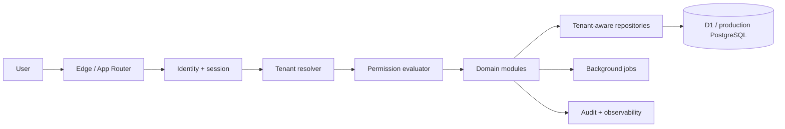

# Hig School architecture — Phase 0

Hig School is a tenant-first modular monolith operated by HIG Automation India Private Limited. The initial deployment uses a Vinext/Next.js App Router application on Cloudflare Workers with D1 for structured records. Domain boundaries are designed to move behind queues or separate services when scale requires it.

## Decisions

- Every school is a tenant; every tenant-owned record carries `tenant_id` and is queried through tenant-aware repositories.
- Authentication and tenant membership are separate concerns. A verified identity must still hold an active membership and permission.
- Permissions use `module.resource.action.scope`; server checks are authoritative.
- Audit events are append-only. Impersonation requires a reason and always renders a visible banner.
- Financial and academic writes will use idempotency keys and transactions in their delivery phases.

## Tenant resolution

Resolution precedence is custom domain, subdomain, then an authorized tenant selector. The selected tenant is stored server-side in the session. Client-supplied tenant identifiers are treated only as requested resources and must equal the session tenant. Platform roles use an explicit platform scope instead of a wildcard tenant.

## Security baseline

Cookies are HTTP-only, secure and same-site. Admin roles require MFA. APIs validate input, rate-limit sensitive actions, scope files and exports, and log actor, tenant, action, resource, reason and outcome. Production PostgreSQL should additionally use row-level security as defense in depth.

## Scale path

The first target is 100 schools and 100,000 students. Indexes begin with tenant plus primary query dimensions. Reporting, notifications, bulk imports and document generation move to jobs. At larger scale, attendance ingestion, notifications and analytics can separate without changing public contracts.
